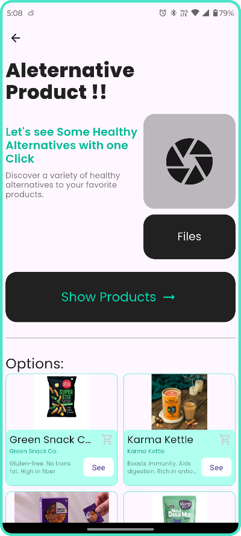
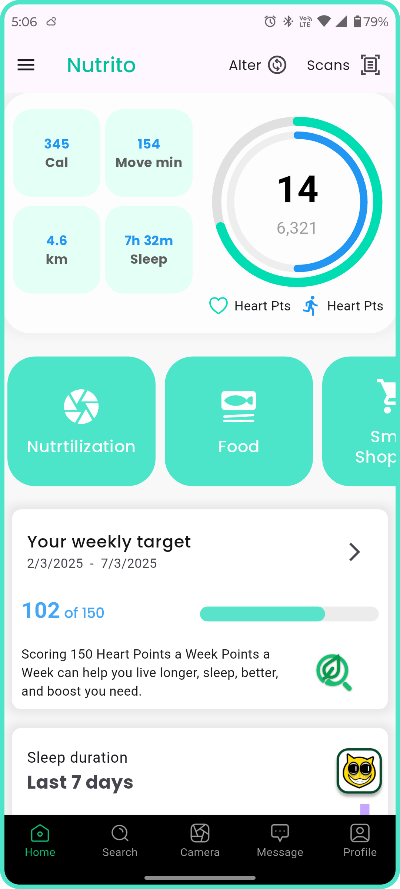
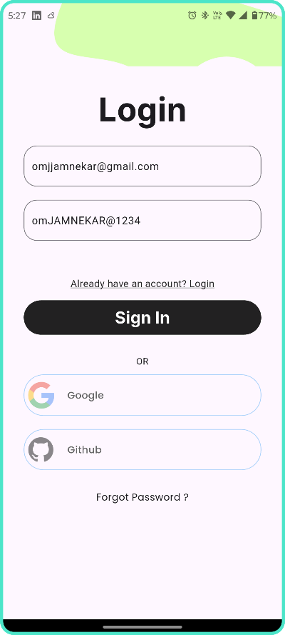
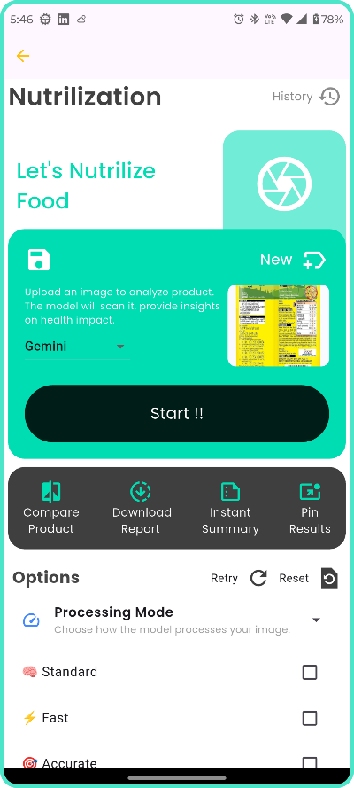
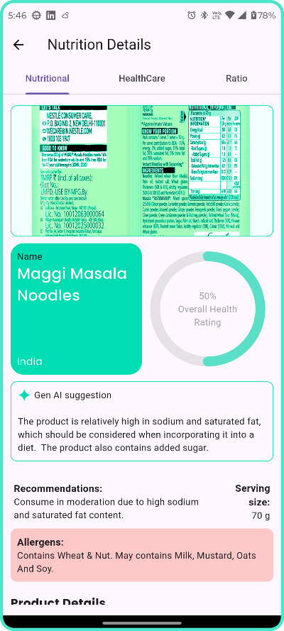
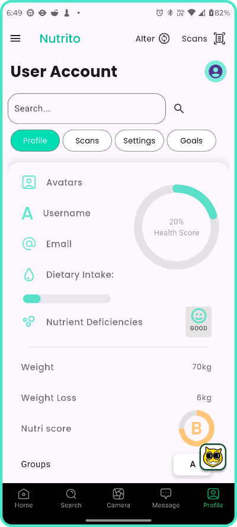
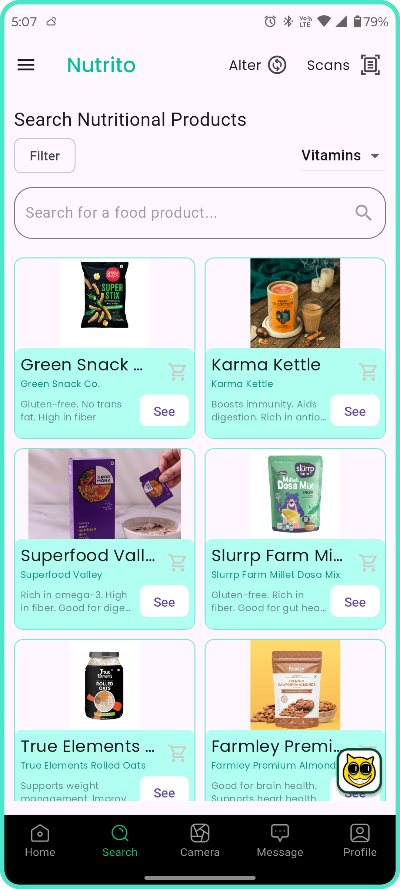
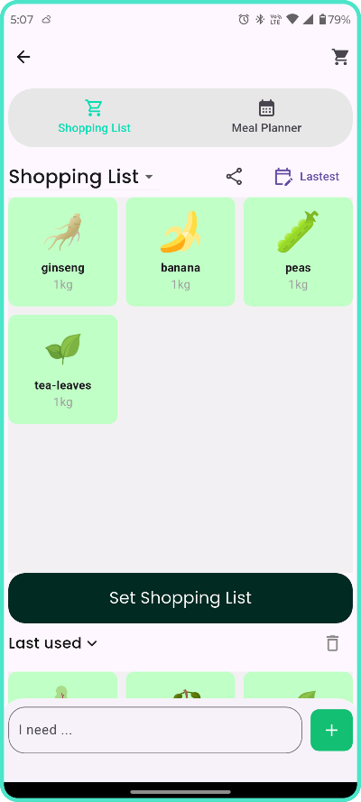
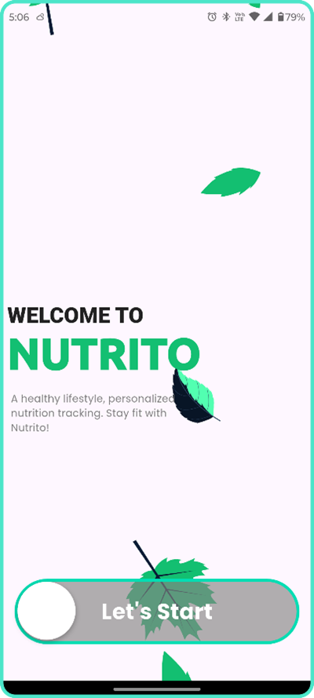

# Nutrito

Nutrito is a mobile application designed to help users make informed food choices by analyzing product ingredients and suggesting healthier alternatives. With advanced image recognition technology, the app provides instant nutritional insights, allergen warnings, and personalized recommendations.


## App Screenshots

Below are screenshots of specific pages from the Nutrito mobile application:
| Page Name             | Screenshot Preview                      |
|-----------------------|-----------------------------------------|
| Alternative Suggestions |  |
| Home                  |            |
| Login                 |          |
| Nutrilization         |  |
| NutriOut              |    |
| Profile               |      |
| Registration          |  |
| Search                |        |
| Shopping List         |  |
| Welcome               |       |

## Features

- **Product Scanning**: Scan food packages to get ingredient analysis.
- **Alternative Suggestions**: Get healthier alternatives based on product comparisons.
- **Health Alerts**: Identify harmful ingredients and allergens.
- **Smart Shopping List**: Manage shopping lists with personalized suggestions.
- **User Profiles**: Customize preferences based on dietary needs.
- **Community Engagement**: Share reviews and interact with other users.
- **AI-Based Recommendations**: Get personalized health recommendations.

## Technologies Used

### Frontend

- **Flutter** (Dart) - For mobile app development.


### Backend

- **Node.js** (Express) - For API management.
- **Python** - For machine learning and image processing.
- **MongoDB** - NoSQL database for storing user data and product analysis.
- **Firebase** - Authentication and cloud storage.
## UI Design (Figma)

You can explore the Nutrito app's UI wireframes and design prototypes on Figma:

[View Nutrito Figma Wireframe](https://www.figma.com/design/Djg2Jdm19gVoMmVeclvLku/NUTRITO-WIREFRAME-?node-id=0-1&t=3ZgbIkryqSlJtQxD-1)

## Installation

### Prerequisites

Ensure you have the following installed:

- **Flutter SDK**
- **Node.js** (v14+)
- **Python 3.x**
- **MongoDB** (Cloud or Local Instance)
- **Firebase Console Setup**

### Steps to Run the Project

1. **Clone the repository**

   ```bash
   git clone https://github.com/yourusername/nutrito.git
   cd nutrito
   ```

2. **Set up the frontend**

   ```bash
   cd frontend
   flutter pub get
   flutter run
   ```

3. **Set up the backend**

   ```bash
   cd backend
   npm install
   node server.js
   ```

4. **Set up the AI Model (Python server)**
   ```bash
   cd ai_model
   pip install -r requirements.txt
   python app.py
   ```

## API Endpoints

| Method | Endpoint                | Description              |
| ------ | ----------------------- | ------------------------ |
| POST   | `/api/register`         | Register a new user      |
| POST   | `/api/login`            | Authenticate user        |
| GET    | `/api/products`         | Get all products         |
| POST   | `/api/scan`             | Scan a product           |
| GET    | `/api/alternatives/:id` | Get alternative products |
| POST   | `/api/nutrilization/`   | get nutri data of products|

### Additional API Endpoints (Python Flask)

Below are additional backend API endpoints implemented in the Python Flask server:

| Method | Endpoint                       | Description                                                      |
|--------|-------------------------------|------------------------------------------------------------------|
| POST   | `/api/initial_prompt`         | Analyze initial product image for ingredient extraction          |
| POST   | `/api/ratio_prompt`           | Analyze product image for nutritional ratio extraction           |
| POST   | `/api/health_prompt`          | Analyze product image for health considerations                  |
| POST   | `/api/conclusion_prompt`      | Analyze product image for conclusion summary                     |
| POST   | `/api/com_compare_product`    | Compare two product images for nutritional differences           |
| POST   | `/api/alternativeSuggestion`  | Suggest alternatives based on product name and description       |
| POST   | `/api/imageAlternativeSuggestion` | Suggest alternatives based on product image                  |
| POST   | `/api/generateAlternative`    | Generate alternative suggestions using AI model                  |
| POST   | `/api/catergoriedSearch`      | Search/filter products by category and nutrient                  |
| POST   | `/api/smartlist`              | Generate a smart shopping list from user input                   |

These endpoints support advanced features such as image-based ingredient extraction, product comparison, and AI-powered alternative suggestions.

## Usage

1. Open the app and register/login.
2. Use the scan feature to analyze food products.
3. View alternative recommendations based on product scans.
4. Save and track scanned products.
5. Engage with the community by sharing reviews.

## Contributors

- **Om Manoj Jamnekar** - Frontend, UI, Deployment,RAG
- **Shiva Purrhottam Aleti** - Backend, API, Database


## Contact

For any inquiries, contact:

- Om Jamnekar - omjjamnekar@gmail.com
- Shiva Aleti - aletishiva218@gmail.com
